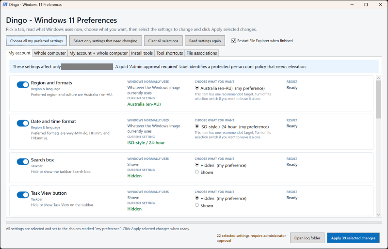

# Dingo

Dingo quickly prepares a fresh Windows 11 installation for use as a DFIR analyst workstation. It applies a consistent set of analyst-friendly preferences, including UTC, ISO-style date and 24-hour time formats, useful File Explorer options, and removal or suppression of distractions such as Widgets and Bing results in Start. It can also install common tools, create shortcuts and command-line launchers, and configure useful file associations.

It is a self-contained, state-aware PowerShell/WPF utility that lets you review each change before applying it.



## Run it

Dingo can be used as an interactive **GUI application** or as a **command-line (CLI) tool** for previews, repeatable setup, and automation. Both modes use the same settings, safety checks, administrator hand-off, verification, results, and logs.

### GUI application

1. Copy the entire Dingo folder to the VM.
2. Double-click Start-Dingo.cmd.
   Do not use **Run as administrator**. Dingo keeps its main window in your signed-in account and asks for administrator credentials later, only when needed.
3. Choose the **My account**, **Whole computer**, **My account + whole computer**, **Install tools**, **Tool shortcuts**, or **File associations** tab.
4. Each card explains the normal Windows choice, the current choice, and the available choices in plain language.
5. Turn on the switches for the cards to change, or use **Choose all my preferred settings**.
6. Choose **Apply selected changes**. Windows requests administrator approval when the selection includes a whole-computer setting or a protected account policy marked **Admin approval required**.

No installation or PowerShell modules are required. Windows PowerShell 5.1 is included with Windows 11.

A console window appears for about a second while PowerShell starts, then hides itself once the Dingo window is open. It comes back if Dingo exits with an error, so the message and the pause prompt are always readable.

### Command line (CLI)

Run Dingo from Command Prompt or PowerShell to preview changes, apply a complete or filtered configuration, inspect the setting catalog, or integrate it into a repeatable setup process. A CLI run keeps its console open because that is where its output is written.

Use the launcher with `-ApplyPreferred` to apply all 39 preferred settings without opening the GUI:

```bat
Start-Dingo.cmd -ApplyPreferred
```

The examples use the launcher so errors remain visible when it is double-clicked. From an existing PowerShell console, you can use `./Dingo.ps1` in place of `Start-Dingo.cmd`.

Dingo still runs as the signed-in user and displays a Windows administrator prompt when the plan contains protected or whole-computer settings. Do not apply changes from an elevated console. Preview the plan without changing anything with:

```bat
Start-Dingo.cmd -WhatIf
```

Limit the plan by stable setting ID, using either repeated values or a comma-separated list:

```bat
Start-Dingo.cmd -ApplyPreferred -Include widgets,taskbar-search
Start-Dingo.cmd -WhatIf -Exclude language-au,windows-update-continuity
```

Add `-NoRestartExplorer` to suppress the automatic File Explorer restart. Exit code `0` means the plan succeeded (or a dry run completed), `1` means at least one setting failed or was only partially applied, `2` means the command or environment was invalid, and `3` means Dingo was already running.

`-ApplyPreferred` refuses to run from an elevated console, because Dingo must keep account settings pointed at your signed-in profile. `-WhatIf` is allowed there, because a dry run changes nothing; its JSON output carries `"Elevated": true` and the text output prints a note, so you know account settings were read from the elevated account. The three self-tests also run either way. This matters in Windows Sandbox, where every process is elevated.

An unrecognised option or stray positional argument is rejected with exit code `2` and the full help text is displayed; Dingo will not fall through to launching the GUI. The launcher preserves Dingo's exit code after displaying its pause prompt.

For automation, add `-OutputFormat Json` to `-WhatIf`, `-ApplyPreferred`, or `-ListSettings`. Discovery and help commands are:

```bat
Start-Dingo.cmd -ListSettings
Start-Dingo.cmd -ListSettings -OutputFormat Json
Start-Dingo.cmd -Version
Start-Dingo.cmd -Help
```

`-h` and `-?` are short aliases for `-Help`.

Current version: **0.6.9**. Phase 4 VM testing corrected wildcard detection in 0.6.3, association write ordering in 0.6.4, cleanup of Explorer's per-user Open With cache in 0.6.5, native Windows association command paths in 0.6.6, and actionable sign-out/restart guidance in 0.6.7-0.6.8. Version 0.6.9 replaces each card's labelled checkbox with a compact unlabelled selection switch while retaining the same batch-selection behavior. Phase 1 is **0.6.0**, Phase 2 is **0.6.1**; patch versions roll over after `.9`.

## Behaviour and safety

- Every item is applied independently and checked against its declared verification basis. Registry checks establish stored values and types, not effective Windows or application behavior. Tool detection does not prove execution.
- Current-state reads distinguish preferred, alternate, partial, unavailable, and error states. A read error is never treated as a missing setting, and **Select only settings that need changing** leaves unreadable settings unselected.
- Results track each registry entry and file extension, including before/after snapshots, requested state, outcome, and scope. Registry writes stop after the first failed entry in that scope and mark remaining entries skipped. Successful earlier changes remain visible as partially applied; there is no automatic rollback. JSON results include the final state and verification basis.
- The GUI stays in the signed-in desktop account, so per-user settings affect the correct Windows profile even when separate administrator credentials are needed. Protected per-user policy values are written by the elevated helper directly to that desktop user's SID, not to the administrator's profile.
- Twenty-eight settings offer plainly labelled reversible choices. The five one-way targets are UTC, Australian region, Australian language, ISO date/time formats, and Widgets removal. The six tool cards offer **Installed** and **Update installed tool**; neither removes a tool. Each can be left alone by turning off its selection switch.
- Applying a selection freezes a separate copy of the plan before preflight. Card choices and the Explorer restart checkbox stay disabled until the operation finishes; the administrator and account steps use the captured choices.
- Shortcut and launcher creation refuses to overwrite a same-name file that Dingo did not create. Existing conflicts are checked in preflight and checked again before writing, including targets discovered after a tool installs. Rename or move the conflicting file before retrying.
- **Read settings again** rereads every configured value without making changes.
- Preflight is all-or-nothing: an unsupported plan is stopped before any changes. Once application begins, an individual setting failure does not stop later selected settings from running.
- Logs are written to the `Logs` folder beside the script, so a copy deployed to `C:\DFIR\Tools\Dingo` logs to `C:\DFIR\Tools\Dingo\Logs`. The GUI can open that folder. Dingo keeps the 20 most recent logs and deletes older ones on the next launch.
- Dingo permits only one normal GUI or quick-apply run per Windows account, preventing concurrent settings and result-file races. Read-only help, version, catalog, and internal self-test commands do not take the instance lock.
- GUI and quick-apply modes use the same setting executor, administrator broker, verification, structured results, and logs.
- Before applying a plan, Dingo checks every selected setting's handler, required Windows commands, readable current state, and declared edition/build requirements. If any preflight check fails, the plan is stopped before changes or administrator approval begin.
- Setting types are registered in an internal handler catalog that owns their scope, state reader, apply function, and prerequisites. This keeps the single-file distribution while providing an extension point for new kinds of setting. Tool installs use a `Package` handler on this same registry, shortcuts use a `Shortcut` handler, and file types use an `Association` handler.
- The window stays open while an administrator operation is active so Dingo can collect its results, verify changes, and remove temporary protocol files. Abandoned protocol files older than 24 hours are removed on a later launch.
- The tool is idempotent: rerunning it writes and verifies the same desired values.
- OneDrive is disabled with policy. It is not uninstalled, and user files are not deleted.
- Windows Widgets is removed only from the signed-in account. Dingo stops that account's `Widgets`, `WidgetService`, and `WidgetBoard` processes by exact name so unrelated tools on an analyst VM are not terminated, uninstalls `Microsoft.WidgetsPlatformRuntime` and `MicrosoftWindows.Client.WebExperience`, and verifies the result using that same account's live AppX package state. Other profiles are left unchanged, and Dingo does not provide a reinstall action.
- The Windows Copilot setting also removes Copilot shortcuts that Windows exposes in the signed-in user's standard taskbar pin folder; it does not uninstall Copilot apps.
- Windows Terminal's settings.json is serialized and validated before it atomically replaces the live file. Every change creates a uniquely named backup, and Dingo keeps the 10 most recent backups per settings file.
- Windows Terminal ships its settings as JSONC, which permits `//` and `/* */` comments and trailing commas. Windows PowerShell 5.1 cannot parse those, so Dingo removes them before reading. Text inside string values, such as a `https://` URL, is left alone. Rewriting the file writes plain JSON: any comment you added survives in the backup but not in the new file.
- The Edge clutter setting removes the new tab page news feed and weather (`NewTabPageContentEnabled`), background images (`NewTabPageAllowedBackgroundTypes` = 3, DisableAll), and quick links (`NewTabPageQuickLinksEnabled`), plus Collections, shopping, Rewards, wallet donations, Insider and default-browser promotions, the web widget, feedback, alternate error pages, asset delivery, and telemetry. It sends Do Not Track and blocks Copilot's Discover Chat extension (`ofefcgjbeghpigppfmkologfjadafddi`). Every value is removable, so the card reverses cleanly. Restart Edge to finish applying it. The three new-tab-page values are the ones that matter most and are not covered by Chris Titus Tech's WinUtil Edge debloat.
- Showing protected operating-system files is intentionally marked with a caution.
- On Windows 11 Pro, Enterprise, or Education, **Forensic continuity: manual update configuration** writes the selected update policies and suppresses all update notifications, including restart warnings. Dingo verifies registry configuration only; it does not establish effective policy or guarantee automatic-restart prevention. Operators must manage patching and maintenance.

## Important limitations

- Microsoft now ships Copilot in several forms. The Windows setting applies the legacy Windows Copilot policy and hides integrated UI, but does not uninstall the newer standalone app. Microsoft recommends AppLocker or managed uninstall policy for centrally blocking that app.
- **Edge search engines are set with `ManagedSearchEngines`, not `DefaultSearchProvider*`.** Edge treats `DefaultSearchProvider*` as a protected policy and blocks it on any device that is not domain joined, Entra joined, or Intune enrolled, reporting `Error, Ignored` at `edge://policy`. `ManagedSearchEngines` is not protected and does apply. It replaces the whole engine list, so Bing is never created rather than removed. Dingo writes it to the `Recommended` key so an analyst can still change engines afterwards, and clears the five `DefaultSearchProvider*` values because `DefaultSearchProviderSearchURL` suppresses `ManagedSearchEngines`. Only the default entry may carry `is_default`: adding `"is_default": false` to another entry makes Edge reject the whole policy with no error anywhere. Restart Edge to finish applying it. Verified on Edge 152, Windows 11 25H2, unmanaged.
- On a profile where someone already chose a search engine by hand, that choice is kept. The policy still removes Bing from the list. A freshly imaged VM has no such choice, so it takes effect there.
- Every current Edge policy Dingo writes was confirmed applied on an unmanaged instance, with none reported as ignored: `edge-first-run` (6 values), `edge-passwords` (4), `edge-copilot` (5), and `edge-debloat` (14 visible on the policy page, plus one under `EdgeUpdate`). `DefaultSearchProvider*` was the only blocked family, and Dingo no longer uses it. Version 0.6.6 also removes the retired `WalletDonationEnabled` and `WebWidgetAllowed` values left by earlier Dingo versions.
- To check any Edge policy yourself, restart Edge, visit `edge://policy`, click **Reload policies**, then **Export to JSON**. Each policy in that file carries an `ignored` flag and an `error` string, which is far quicker than guessing from behaviour.
- Removing the entire Recommended section is edition/build dependent. The tool disables recent and suggested content and applies the section-hiding policy where available.
- Microsoft does not ship a standalone full display pack for English (Australia). Windows exposes **English (Australia)** as a selectable interface language once the British English (`en-GB`) base resources are installed. Dingo installs that underlying display pack when needed, then selects `en-AU` for the Windows interface, input, spelling, regional formats, and system locale. Windows applies and reports the requested UI language after sign-out or restart.
- While a language pack is downloading, Dingo keeps its window responsive, shows the elapsed time in the status area, and records an installation heartbeat in the log every 30 seconds. Other controls remain disabled until the administrator step finishes so that settings cannot be applied twice concurrently.
- Dingo isolates its WPF interface from elevation operations by delegating administrator approval to a separate non-WPF broker process. It avoids fragile `Shell.Application` enumeration during state scans; Copilot policies and ordinary taskbar shortcuts are handled directly, while an opaque packaged-app pin may need to be unpinned manually.
- When a language-profile change is pending, Dingo registers a one-time sign-in finalizer for its ISO date/time preference. This reapplies the custom formats after Windows finishes initialising the new language, preventing Windows from replacing them with the locale defaults.
- Long-path, OneDrive, and Copilot changes can require a restart.
- The update configuration does not cancel pending or user-scheduled restarts. Management policy can override it. A configured card is not evidence that a processing window is safe from restarts; review effective update policy and pending restart state separately.
- Windows Terminal must have been launched at least once so its settings file exists.
- Tool installs use winget, which needs a working network connection and the Microsoft `winget` source. If winget itself is missing, preflight stops the plan and says so, rather than failing halfway through an install.
- A winget install is given 15 minutes before Dingo gives up on it and stops the process. winget's own output is written to the log on both success and failure.
- **Installed**, including `-ApplyPreferred`, leaves a detected installation unchanged, whatever its version. Detection is repeated in the executing account immediately before installation; winget also receives `--no-upgrade` for this action. **Update installed tool** explicitly invokes the installer for a detected installation. Dingo provides no uninstall action.
- If winget reports that a package is already present with nothing newer available, Dingo treats that as a success, because the tool is installed either way. Detection normally prevents this from happening at all.
- `-ApplyPreferred` now installs missing tools as well as changing settings, because "installed" is the preferred state for a tool card. Use `-Exclude` with the `tool-` IDs, or `-Include`, if you want settings only.
- A tool can declare that it needs another tool, with a `requires` list. When the other tool is absent, the card shows an amber caveat saying the tool will not start, and the same text appears as `Advisory` in `-WhatIf -OutputFormat Json`. A caveat never blocks the plan, because that would stop unrelated settings from being applied.
- Eric Zimmerman's tools are built on .NET 9, and a fresh Windows 11 install does not include it. Without it every tool fails to start with `You must install .NET to run this application`. Dingo therefore offers **.NET 9 Desktop Runtime** as its own card, listed before the tools that need it so a single run installs them in the right order. This was found by testing in Windows Sandbox, which is as bare as a freshly imaged VM.
- Dingo detects Eric Zimmerman's tools by looking for **Timeline Explorer** and **Registry Explorer**, not for a command-line tool. A partial copy holding only the command-line tools is common, and detecting on those would wrongly report a complete install.
- The `script` install kind downloads a PowerShell script and runs it with administrator rights. That is how the author distributes these tools, and it is the same thing you would do by hand. Dingo refuses any address that is not `https://`, and logs the URL and the SHA256 of the file it actually ran.
- To update Eric Zimmerman's tools, choose **Update installed tool** on its card, then apply the selected change. This runs the author's script again to fetch changed tools. Choosing **Installed** again leaves a detected installation alone. Use the same explicit update choice for winget tools; if a tool is missing, choose **Installed** first.
- Eric Zimmerman's tools land in `C:\DFIR\Tools\EZTools\net9`, in a mixed layout: some tools are a loose `.exe`, others get their own folder. Select **Run tools from anywhere** to reach them from any folder.
- Dingo reads the computer PATH without expanding it and writes it back as an expandable value. Real machines hold entries such as `%USERPROFILE%\go\bin`, and reading PATH the easy way expands those, which would permanently bake one account's folders into the computer PATH. The self-test proves this on a stand-in value before anything is written.
- A PATH change reaches new windows only. Restart any open terminal, and sign out and back in for programs started from Explorer.
- File associations can only be set for a file type nothing has claimed yet. Windows protects a type that already carries a user choice, and no supported method can take one on a computer that is not joined to a domain. Dingo says which types it cannot take, on the card, and adds an Open with entry for those instead.

## Settings included

Thirty-nine settings. Six install tools. Two make shortcuts, one puts the tools on the PATH, and three set file types. The ID in the first column is the stable name used by `-Include` and `-Exclude`. **Scope** is whose settings change, and **Admin** is whether Windows asks for administrator approval. Run `Start-Dingo.cmd -ListSettings` for the same list from the tool itself.

### Region and language

| ID | Setting | Scope | Admin | Preferred |
| --- | --- | --- | --- | --- |
| `timezone-utc` | Time zone | System | yes | UTC |
| `region-australia` | Region and formats | User | no | Australia (en-AU) |
| `language-au` | Australian English | Both | yes | en-AU interface and locale |
| `iso-time` | Date and time format | User | no | yyyy-MM-dd, 24-hour |

### Taskbar

| ID | Setting | Scope | Admin | Preferred |
| --- | --- | --- | --- | --- |
| `taskbar-search` | Search box | User | no | Hidden |
| `task-view` | Task View button | User | no | Hidden |
| `widgets` | Windows Widgets | User | no | Removed for this account |
| `resume` | Cross-device Resume | Both | yes | Disabled |
| `never-combine` | Combine taskbar buttons | User | no | Never combine |
| `end-task` | End task on right-click | User | no | Enabled |

### File Explorer

| ID | Setting | Scope | Admin | Preferred |
| --- | --- | --- | --- | --- |
| `explorer-this-pc` | Default landing page | User | no | This PC |
| `hidden-files` | Hidden files and folders | User | no | Shown |
| `file-extensions` | File-name extensions | User | no | Shown |
| `protected-files` | Protected operating-system files | User | no | Shown (caution) |
| `expand-nav` | Expand navigation pane | User | no | Enabled |
| `long-paths` | Win32 long paths | System | yes | Enabled |

### Windows features and updates

| ID | Setting | Scope | Admin | Preferred |
| --- | --- | --- | --- | --- |
| `onedrive` | OneDrive file sync | System | yes | Disabled by policy |
| `windows-copilot` | Windows Copilot and taskbar icon | Both | yes | Disabled |
| `windows-update-continuity` | Forensic continuity: manual update configuration | System | yes | Configured; manual maintenance |

### Microsoft Edge

| ID | Setting | Scope | Admin | Preferred |
| --- | --- | --- | --- | --- |
| `edge-first-run` | First-run and import extras | System | yes | Suppressed |
| `edge-passwords` | Edge password manager | System | yes | Disabled |
| `edge-copilot` | Copilot in Edge | System | yes | Disabled |
| `edge-search-engines` | Search engines | System | yes | Google and DuckDuckGo, no Bing |
| `edge-debloat` | Clutter, promotions, and new tab page | System | yes | Removed |

### Windows Terminal and Start menu

| ID | Setting | Scope | Admin | Preferred |
| --- | --- | --- | --- | --- |
| `terminal-cwd` | Windows PowerShell starting directory | User | no | Parent process directory |
| `start-bing` | Bing/web search | User | yes | Disabled |
| `start-recommendations` | Recommendations | Both | yes | Disabled |

### Tools

Tool cards live on the **Install tools** tab. **Installed** is the preferred action: keep a detected installation or install a missing one. **Update installed tool** is an explicit maintenance action and requires the tool to be detected already. `-ApplyPreferred` and **Choose all my preferred settings** always use **Installed**, never the update action. Neither choice uninstalls a tool.

The **Tool shortcuts** tab holds the three cards that make an installed tool easy to reach: Start menu shortcuts, Desktop shortcuts, and command-line access. The **File associations** tab decides which program opens which file type.

EZTools detection requires a minimum inventory of Timeline Explorer, Registry Explorer, EvtxECmd, and RECmd under their net9 subfolders, plus the declared .NET prerequisite. Missing inventory or prerequisites produces a partial state. This does not prove every upstream download succeeded or any program runs. Completing an incomplete installation reruns the upstream installer, which can also replace existing files.

A reported version comes from file or uninstall metadata. A .NET build stamps its git commit onto that version, so Timeline Explorer reports `2026.5.0+74bece05a5...`. Dingo shows only the part before the plus.

Cards on the **Install tools** tab:

| ID | Tool | Scope | Admin | Preferred |
| --- | --- | --- | --- | --- |
| `tool-7zip` | 7-Zip | System | yes | Installed |
| `tool-notepadplusplus` | Notepad++ | System | yes | Installed |
| `tool-ripgrep` | ripgrep | User | no | Installed |
| `tool-sqlitebrowser` | DB Browser for SQLite | System | yes | Installed |
| `tool-dotnet-desktop-9` | .NET 9 Desktop Runtime | System | yes | Installed |
| `tool-eztools` | Eric Zimmerman's tools | System | yes | Installed |

Cards on the **Tool shortcuts** tab:

| ID | Card | Scope | Admin | Preferred |
| --- | --- | --- | --- | --- |
| `tools-start-menu` | Start menu shortcuts | System | yes | Created |
| `tools-desktop` | Desktop shortcuts | System | yes | Created |
| `tools-on-path` | Run tools from anywhere | System | yes | On the PATH |

A tool installs machine-wide where its winget package supports it, which needs administrator approval. ripgrep ships as a portable package, so it installs into the signed-in account only and needs no approval. winget adds ripgrep to the user PATH by itself.

Eric Zimmerman's tools are not in winget. Dingo runs the author's own `Get-ZimmermanTools.ps1` instead, fetched over https from `EricZimmerman/Get-ZimmermanTools` on GitHub, and installs into `C:\DFIR\Tools\EZTools`. The bootstrap script is pinned to revision `d808d1dfe6446faf884576a8a1c11b6875197a19` and expected SHA256 `B9122527E7049D2AB3F9A58BC972189AAC62FAD9A83FDA59EA6B70C7360D7834`. Dingo refuses a hash mismatch before execution. The URL, actual/expected hash, and Authenticode status are journaled. This pins the bootstrap script only: its downstream tool downloads remain controlled by upstream. That download is several hundred megabytes and is given 45 minutes.

**Run tools from anywhere** is not a tool. It writes one small `.cmd` launcher for each installed command-line program into `C:\DFIR\Tools\bin`, then adds that single folder to the computer PATH. You can then type `EvtxECmd -d "path"` from any folder.

Eric Zimmerman's tools need this because `C:\DFIR\Tools\EZTools\net9` has a mixed layout: some tools are a loose `.exe`, others sit in their own folder. Putting all of those on the PATH would mean about 30 entries. One launcher folder means one entry.

The folder is added to the **end** of the PATH, so a tool can never shadow a Windows command such as `find` or `where`.

This card is reversible. Turning it off removes the PATH entry and deletes the launchers. Dingo only ever deletes `.cmd` files that carry its own marker line, so anything you put in that folder by hand is left alone. Already-open windows keep the old PATH until they are restarted.

This card is applied last, after the tools its launchers point at, so installing a tool and putting it on the PATH can be done in a single run.

**Start menu shortcuts** and **Desktop shortcuts** are not tools either. Some installers make no shortcut at all, so the program sits on disk and nobody can find it. `Get-ZimmermanTools.ps1` is the clearest case: it makes none. These two cards write a shortcut for each installed window tool.

| Card | Where the shortcuts go |
| --- | --- |
| `tools-start-menu` | `C:\ProgramData\Microsoft\Windows\Start Menu\Programs\DFIR Tools` |
| `tools-desktop` | `C:\Users\Public\Desktop` |

Both locations are shared, so the shortcuts appear for every account on the computer. Both cards are applied after the tool cards, so installing a tool and getting its shortcut can be done in a single run.

Seven shortcuts are offered today, all from Eric Zimmerman's set: Timeline Explorer, Registry Explorer, MFT Explorer, ShellBags Explorer, Jump List Explorer, SDB Explorer, and EZViewer. Only the window tools are listed. A command-line tool is reached through **Run tools from anywhere** instead. 7-Zip, Notepad++, and DB Browser for SQLite make their own Start menu entries, so Dingo does not add more.

A shortcut whose program is not on disk is skipped, not reported as a failure. Its working folder is set to the folder the program lives in, because several of these tools read their own files from beside themselves.

Both cards are reversible. Turning one off removes only shortcuts that carry Dingo's marker in the shortcut comment, so a shortcut you made by hand, or one an installer made, is left alone. Turning off the Start menu card also removes the `DFIR Tools` folder, but only when it is empty. The shared Desktop folder belongs to Windows and is never removed.

### File associations

The **File associations** tab decides which program opens which file type. These are your account's choices, written under `HKCU`, so no administrator approval is needed.

| ID | Card | Types it offers |
| --- | --- | --- |
| `assoc-notepadplusplus` | Notepad++ file types | `.json` `.md` `.yml` `.yaml` `.ini` `.conf` |
| `assoc-eztools` | Eric Zimmerman's tools file types | `.csv` `.tsv` (Timeline Explorer), `.dat` (Registry Explorer) |
| `assoc-sqlitebrowser` | DB Browser for SQLite file types | `.db` `.sqlite` `.sqlite3` |

One card can send different file types to different programs. On an analysis VM a `.dat` file is almost always a registry hive, `NTUSER.DAT` or `UsrClass.dat`, so that type goes to Registry Explorer while `.csv` and `.tsv` go to Timeline Explorer.

These cards run after the tool cards, so installing a tool and setting its file types happens in one run. A type whose program is missing records a failure; successful changes to other extensions remain visible as partial application.

**What Windows allows, and what it does not.** A file type that nothing has claimed can be set freely. A file type that already carries a `UserChoice` cannot be taken by anything: the key is locked and Windows validates an undocumented hash in it. The one documented way around that, the *Set a default associations configuration file* policy, works only on a domain-joined computer, and was measured doing nothing on a Windows 11 Pro workgroup VM across two restarts. Dingo therefore does not try.

So `.txt` and `.log` are deliberately absent from the Notepad++ card. The Windows Notepad app owns them on a fresh install and will not give them up.

For any type it cannot take, Dingo adds the tool to the **Open with** list instead, and the card names the types it could not take and why. A blocked type counts as configured only when its Open with registration and command are valid and the target exists. The card explicitly distinguishes defaults from Open with fallback; it does not launch the program to verify Windows behavior.

**How it works.** Dingo registers its own handler name for each program, such as `Dingo.notepad++`, holding the program path and its icon. The extension is then pointed at that name. Because every name Dingo creates starts with `Dingo.`, ownership is never in doubt.

**Turning a card off** puts back whatever the file type pointed at before, which Dingo saved under `HKCU\Software\Dingo\FileAssociations` when it made the change. If the type had no handler at all, the key Dingo created is removed. Dingo also removes its handler name if Explorer copied it into the account's `FileExts` Open With history after use. A file type pointing at somebody else's handler is never redirected. If Windows UserChoice points to a Dingo handler, reversal fails with instructions to choose another default in Windows Settings and preserves the working registration. Shared Dingo handler commands are retained because other extensions or UserChoice entries may still reference them.

Detection does not depend on winget. Dingo reads the Windows uninstall list under both HKLM and HKCU, checks the usual install folders, and looks on the PATH. A tool installed by hand, or by Chocolatey, is still found.

## Adding your own tools

Put a `Tools.json` file next to `Dingo.ps1`. A new `id` adds a tool. An `id` that matches a built-in one replaces it. Comments and trailing commas are allowed.

```json
{
  "tools": [
    {
      "id": "tool-hxd",
      "name": "HxD",
      "category": "Text and data",
      "description": "Hex editor.",
      "install": { "kind": "winget", "package": "MHNexus.HxD", "scope": "machine" },
      "detect": [ { "kind": "uninstall-key", "match": "HxD*" } ]
    }
  ]
}
```

| Field | Required | Notes |
| --- | --- | --- |
| `id` | yes | Must look like `tool-example`: lower case, digits, and hyphens |
| `name` | yes | Shown on the card |
| `category` | no | Defaults to `Tools` |
| `description` | no | Defaults to "Install \<name\>" |
| `install.kind` | no | `winget` (default) or `script` |
| `install.package` | winget only | The exact winget package id |
| `install.url` | script only | `https://` address of the install script. Plain `http` is refused |
| `install.sha256` | no | Expected 64-character SHA256 for a script; mismatch blocks execution. Omission keeps custom catalogs compatible but only records provenance, with a warning. Authenticode status is recorded, not enforced |
| `install.dest` | script only | Folder the script installs into. Dingo creates it if needed |
| `install.arguments` | no | Extra arguments for the script. `-Dest` is always passed for you |
| `install.timeoutMinutes` | no | 1 to 240. Defaults to 15 for winget and 45 for a script |
| `install.scope` | no | `machine` (default) or `user`. This decides whether the card needs administrator approval |
| `install.source` | no | winget only. Defaults to `winget` |
| `detect` | yes | One or more rules with nonempty targets |
| `detectMode` | no | `any` (default) accepts the first matching rule; `all` requires every rule |
| `requires` | no | List of other tool IDs this one needs. Missing prerequisites produce a partial state |
| `shims.from` | no | Folder to scan for command-line programs. Adding this block puts the tool's programs on the PATH |
| `shims.pattern` | no | Defaults to `*.exe` |
| `shims.recurse` | no | Defaults to `true` |
| `shortcuts` | no | List of window programs that need a Start menu or Desktop shortcut |
| `shortcuts[].name` | yes, inside the list | The shortcut name. It becomes a file name, so `\`, `/`, and `:` are refused |
| `shortcuts[].target` | yes, inside the list | The program the shortcut opens. Skipped quietly when it is not on disk. Write it with forward slashes |
| `shortcuts[].arguments` | no | Extra arguments passed to the program |
| `associations` | no | List of file types this tool should open |
| `associations[].extension` | yes, inside the list | Must start with a dot, for example `.json` |
| `associations[].target` | yes, inside the list | The program that opens it. Forward or backslashes are accepted; Dingo stores a native Windows path |
| `associations[].description` | no | The file type name Explorer shows, for example `JSON file` |

Detect rule kinds:

| Kind | Field | Meaning |
| --- | --- | --- |
| `uninstall-key` | `match` | Wildcard match on the Windows uninstall display name, for example `7-Zip*` |
| `file` | `path` | A file that must exist, or a wildcard such as `.../Microsoft.WindowsDesktop.App/9.*` to match a versioned folder whose exact patch number is unknown. A matched folder reports its own name as the version. `%ProgramFiles%` and other environment names are expanded. A backslash starts an escape in JSON, so write the path with forward slashes, or double every backslash |
| `command` | `command` | An executable that must be on the PATH, for example `rg.exe` |

A tool entry Dingo cannot understand is skipped, and the reason is written to the log and shown at the top of the Install tools tab. A `Tools.json` that will not parse at all is ignored, and the built-in list is used instead. Dingo still starts either way.

`Tools.json` names commands that Dingo will run. Treat it with the same care as `Dingo.ps1` itself.

## Execution and interrupted runs

Installer arguments preserve empty values, embedded quotes, and trailing backslashes. Both output streams are drained concurrently, retaining the last 64 KiB of characters from each. A Windows Job Object tracks the assigned installer and descendants, including children that outlive their parent. Timeout closes the job and reports possible partial installation. This is not a security sandbox: external installer services and any process that escapes before assignment may remain active. Job assignment failure stops the run instead of continuing without tracking. Phase 4 validated real winget, UAC, script-installer, timeout, and interruption behavior on the recorded disposable VM; other Windows builds and installer-service edge cases still require appropriate testing.

Script downloads have a 120-second network timeout and refuse redirects. Use a direct HTTPS URL for custom scripts. Pin updates require reviewing the new revision and calculating a new expected hash; merely recording an observed hash does not establish trust.

Before each setting scope runs, Dingo flushes a `Started` record to a per-process `*.journal.jsonl` file beside its log. A `Completed` record preserves the scope results. Journals remain after temporary worker results and old `.log` files are removed. They can contain paths and before/after configuration data; archive or remove them manually according to your retention needs.

Inspect interrupted scope records without applying anything:

```bat
Start-Dingo.cmd -RecoveryReport
Start-Dingo.cmd -RecoveryReport -OutputFormat Json
```

A missing completion record means **unknown**, not rolled back or safe to retry. A scope may still be running. Read current settings again, inspect installer processes and the journal, then explicitly select any retry. Damaged journal records are reported. The report does not replay operations, restore backups automatically, or establish final Windows behavior; a completed scope can still have failed components or await final setting verification.

## Regression checks

For real Windows validation, use the [Phase 4 VM test pack](Tests/Phase4/README.md). Begin with a snapshot and the read-only baseline collector; the checklist targets an existing Windows 11 Pro VM with one administrator-capable account and UAC consent.

Run the isolated checks with Windows PowerShell 5.1:

```powershell
powershell.exe -NoProfile -STA -ExecutionPolicy Bypass -File .\Tests\Phase1.Tests.ps1
powershell.exe -NoProfile -STA -ExecutionPolicy Bypass -File .\Tests\Phase2.Tests.ps1
powershell.exe -NoProfile -STA -ExecutionPolicy Bypass -File .\Tests\Phase3.Tests.ps1
```

These checks import function definitions without starting Dingo. They exercise JSONC preservation, captured plans, WPF card locking, file collisions, and install/update dispatch. Installer and machine-setting operations are mocked. Temporary files and shortcuts are created in a unique directory beneath `Tests` and removed afterwards; no registry values are written. Phase 2 adds inventory/prerequisite detection, association fallback and reversal, per-entry failures, elevated-result serialization, registry types, and verification wording. Phase 3 compiles a harmless local process fixture to test real argument delivery, concurrent output, and descendant timeouts, plus mocked downloads and journal recovery. These checks do not establish live installer, UAC, default-app, or effective policy behavior; those need a disposable Windows VM integration pass.

## Credits

**[Chris Titus Tech's WinUtil](https://github.com/ChrisTitusTech/winutil)** has been an excellent resource for this project, and deserves the credit. Its `EdgeDebloat` tweak is a well-researched, working list of Edge policies that genuinely apply on an ordinary standalone machine, which is exactly the hard part. Most of Dingo's `edge-debloat` setting comes from that list.

Just as usefully, WinUtil showed what to avoid. It sets no search-engine policy at all, and that absence was the clue that Microsoft treats the default search provider as a protected policy which Windows silently refuses to honour on a machine that is not domain joined, Entra joined, or Intune enrolled. That saved a lot of guesswork and led Dingo to `ManagedSearchEngines` instead.

WinUtil is a reference only. Dingo does not bundle, download, or execute any part of it, and the two projects are unrelated. If you want a broader Windows utility that goes well past preferences, use WinUtil directly.

Other sources:

- Microsoft's [Edge policy reference](https://learn.microsoft.com/en-us/deployedge/microsoft-edge-policies) and Windows settings documentation, for every policy name, type, and permitted value.
- Eric Lawrence's [Managing Edge via Policy](https://textslashplain.com/2020/08/24/managing-edge-via-policy/), which explains why some Edge policies are marked "protected" and ignored on unmanaged devices.
